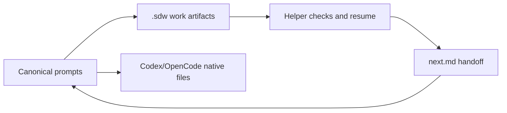

# Spec Driven Workflow

Spec Driven Workflow keeps AI-assisted work understandable across sessions by
storing scope, decisions, tasks, checks, and the next action in Markdown.



## Quick start

Install in an ordinary Git repository:

```bash
curl -fsSL https://raw.githubusercontent.com/roperi/spec-driven-workflow/main/install.sh | bash -s -- --tools codex,opencode
```

Start a work item from your primary harness:

```bash
codex --cd . "Use SDW sdw.workflow for work item fix-login-timeout: Fix the login timeout."
opencode run --dir . --agent sdw.workflow "Fix the login timeout."
```

The primary session creates the work directory and initial artifacts. You do
not need to run the helper's initialization command first.

The same canonical prompts can be continued in either harness. Planning-only
stops are written to `next.md`; a later session reads that handoff and checks
the relevant artifacts before proceeding.

## Documentation

- [Product guide](docs/README.md)
- [Quick start](docs/quickstart.md)
- [Commands and stages](docs/reference.md)
- [Customization](docs/customization.md)
- [Integrations](docs/integrations.md)
- [Roadmap](docs/roadmap.md)

Native projections are supported for Codex and OpenCode. The installer does
not configure credentials, permissions, models, or global settings. Node 18 or
newer is required by the helper.
