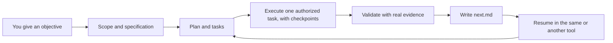

# Spec Driven Workflow

Spec Driven Workflow (SDW) helps you understand and agree the work, then carries
it through implementation and verification while preserving decisions, progress,
and authority across sessions, models, and tools — in plain Markdown, not chat
history.

Agents are fast at individual edits, but long-running work loses structure:
requirements drift, decisions disappear into chat history, and context is gone
when the session restarts. SDW gives that work a durable, repository-owned path
from an agreed scope to verified delivery, so you, a later session, or a
different model or tool can pick it up without replaying the original
conversation.

The lifecycle is one resumable flow:

```text
scope → spec → plan → task → execute → validate → review → publish → finalize → retrospect → wrap
```

## What you get

- **Continuity across sessions, models, and tools** — the records and `next.md`
  carry the agreement, progress, authority, and next action, so work resumes in a
  fresh session or a different harness without the old chat. A dependency-free
  helper checks record shape and resume; it never infers approval from prose.
- **A spec-driven lifecycle** — explicit stages and artifacts, with review kept
  as its own candidate-based responsibility.
- **Human authority and explicit stops** — planning-only handoffs and authorized
  delivery; publishing, merging, and deleting work always require your say-so,
  and a saved stop survives the handoff.
- **Reality-based validation** — checks matched to the change, exact evidence,
  honest limitations, and bounded repair instead of weakened requirements.
- **Proportional rigor** — compact records for small work and an explicit
  hardened profile for safety-boundary work, with project context reused across
  work items.
- **One workflow, many tools** — canonical prompts projected natively into Codex
  and OpenCode and readable as plain Markdown by any other tool.
- **Isolated parallel work** — separate worktrees and work IDs to compare
  alternatives or build pieces, with deliberate selection and integration.

## Quick start

Run this inside the Git repository you want SDW to work in:

```bash
cd your-project
curl -fsSL https://raw.githubusercontent.com/roperi/spec-driven-workflow/main/install.sh | bash -s -- --tools codex,opencode
```

Then open your coding agent in that repository and give it the objective in plain
language. For example:

> Use SDW for work item fix-login-timeout: Fix the login timeout.

- **Codex** — start `codex` in the repository and paste the request.
- **OpenCode** — start `opencode` and paste the request.

The agent creates `.sdw/work/fix-login-timeout/`, drafts the initial artifacts,
and carries the work through scope, specification, planning, and execution as far
as your request authorizes. You do not run a helper command to start. A
planning-only request leaves an explicit stop in `next.md`.

SDW requires Node.js 18 or newer and an ordinary Git repository; the one-line
installer also needs `curl` or `wget`. The `--tools` list selects which native
projections to generate, so pass only the tools you use. The installer writes the
helper and canonical prompts under `.sdw/`, the selected native files, and one
marker-delimited block in `AGENTS.md`. It never creates or modifies
`.sdw/work/` or `.sdw/project-context/`, and it does not change credentials,
permissions, models, or global tool settings.

Prefer a terminal command instead? The [quick start](docs/quickstart.md) and
[integrations guide](docs/integrations.md) show the `codex` and `opencode run`
forms.

## How it works



Each work item lives in `.sdw/work/<work-id>/`. Records are created as their
responsibility occurs, and `next.md` states the next responsibility, whether the
work is ready or waiting, and what remains. A new session reads `next.md` and the
relevant artifacts before continuing, so continuity comes from files rather than
chat history.

SDW stops where you tell it to. Publishing, merging, and deleting work always
require your explicit authority, and an upstream approval authorizes work rather
than proving it correct.

## Supported tools

Codex and OpenCode receive native projections rendered from the same canonical
prompts, so work started in one can be resumed in the other. Other tools can read
the canonical Markdown prompts directly. See [integrations](docs/integrations.md)
for the projected files and route details.

## How SDW compares

Spec-driven development is an established space, and these tools share a common
premise: agree the intent in writing before implementing, and keep the artifacts
with the project. The differences are mostly in what you run, which agents it
plugs into, and where the work lives.

| Tool | What it is | Works with | Process | State and continuity |
| --- | --- | --- | --- | --- |
| **SDW** | Markdown records + dependency-free Node helper (MIT) | Codex and OpenCode natively; any tool can read the canonical prompts | Full lifecycle `scope → … → wrap` with explicit stops; compact or hardened rigor | Repo files under `.sdw/work/`; resume across sessions, models, and supported tools through `next.md` |
| [Spec Kit](https://github.com/github/spec-kit) | Python CLI + agent skills (MIT) | Many agents through integration keys | `constitution → specify → plan → tasks → implement → converge`, plus bug-fix and idea-assessment extensions | Project artifacts under `.specify/`; specs evolve over time |
| [OpenSpec](https://github.com/Fission-AI/OpenSpec) | Node CLI + slash commands (MIT) | 30+ agents | `explore → propose → apply → archive`; lighter, revisable artifacts | `openspec/` specs and per-change folders; optional shared Stores for cross-repo planning |
| [Superpowers](https://github.com/obra/superpowers) | Plugin and skill library (MIT) | Many agents and IDEs | Auto-triggered `brainstorm → worktree → plan → subagent/TDD execution → review → finish branch` | Design docs, plans, and git worktrees, organized around the active session |
| [BMAD Method](https://github.com/bmad-code-org/BMAD-METHOD) | Skills CLI, plugins, and modules (MIT) | Skills-capable tools | Right-sized `clarify → plan → build/verify → learn`, with specialized agent perspectives | Briefs, specs, and architecture as durable project context |
| [GSD Core](https://github.com/open-gsd/gsd-core) | Node installer + command and agent bundles (MIT) | Claude Code, Codex, OpenCode, Copilot, Cursor, Windsurf, and more | Per-milestone `discuss → plan → execute → verify → ship` | `STATE.md` and `CONTEXT.md` survive session boundaries; fresh-context subagents |
| [Kiro](https://kiro.dev) | Integrated IDE, CLI, web, and mobile product (proprietary, AWS) | Its own surfaces; ACP, `AGENTS.md`, and Skills | Specs `requirements → design → tasks`, with parallel task execution and property-based checks | Project specs and cloud sessions; steering files sync across its surfaces |

*Summary of each project's public documentation as of September 2026; not a
ranking, and the details are changing. Each name links to its project.*

## Documentation

- [Quick start](docs/quickstart.md)
- [Command and stage reference](docs/reference.md)
- [Integrations](docs/integrations.md)
- [Customization](docs/customization.md)
- [Roadmap](docs/roadmap.md)
- [Product guide](docs/README.md)

## Contributing and license

Report bugs and propose features through the [contributing
guide](docs/contributing.md). SDW is released under the [LICENSE](LICENSE).
