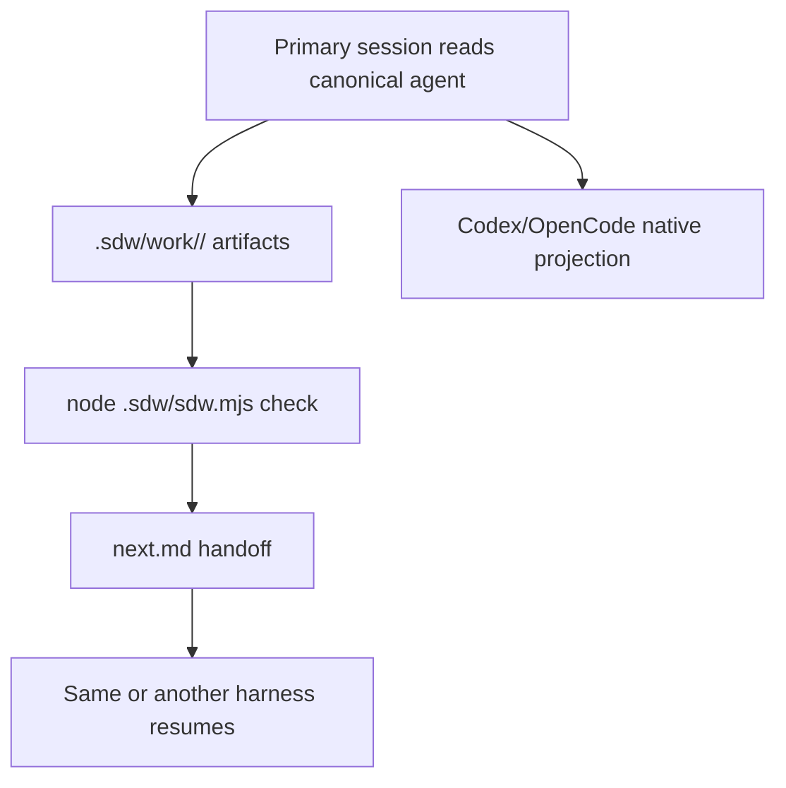
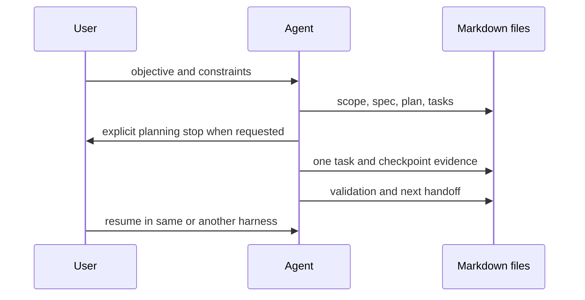

# Spec Driven Workflow

Spec Driven Workflow helps you understand and agree the work, then carries it
through implementation and verification while preserving decisions, progress,
and authority across sessions, models, and tools — in plain Markdown.
Install it in an ordinary Git repository, choose the harnesses that should
receive native projections, and keep the work artifacts under version control
when they are useful to the project.

Start with [Quick start](quickstart.md), then use the [Command and stage
reference](reference.md). Native integration details are in
[integrations](integrations.md). See [customization](customization.md) and the
[roadmap](roadmap.md) for project-owned changes and future scope.

## Workflow

The prompts describe responsibilities and stops. They do not grant permission
to publish, merge, delete work, or change global settings. The helper checks
structure and persistence; it cannot judge whether a specification or test
claim is substantively correct.

## Files

The installer owns `.sdw/sdw.mjs`, `.sdw/installer.mjs`, `.sdw/render.mjs`,
`.sdw/agents/`, `.sdw/templates/`, `.sdw/docs/`, selected native projections,
and its marker block in `AGENTS.md`. `.sdw/work/` and `.sdw/project-context/`
are user-owned. Git tracks useful Markdown artifacts; private raw logs can
remain ignored.

## Support

Native files and direct primary-session routes are supplied for Codex and
OpenCode. Invoke SDW with the user's objective; `sdw.workflow` owns creation of
the work directory and initial artifacts and the whole authorized lifecycle in
one primary session, and `sdw.resume` continues an existing work item in the same
or another supported harness. Other harnesses can read the canonical Markdown
prompts directly.
The installer does not configure credentials, permissions, models, or global
settings. Node.js 18 or newer is required by the helper.

For how to report a bug or propose a feature, see the
[contribution guide](contributing.md).
